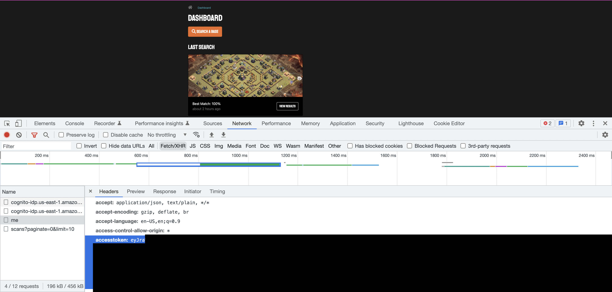
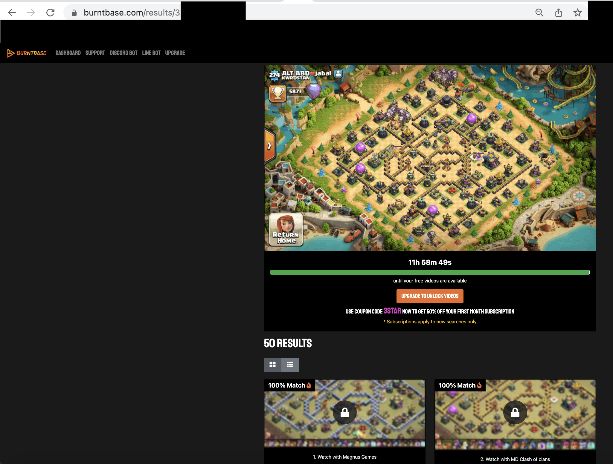
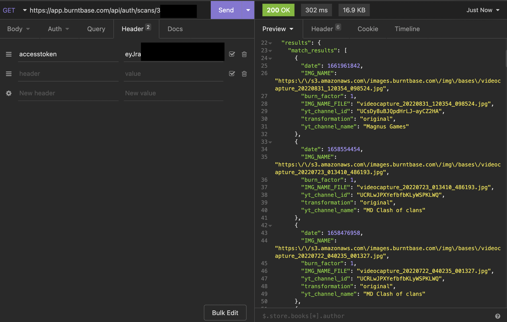
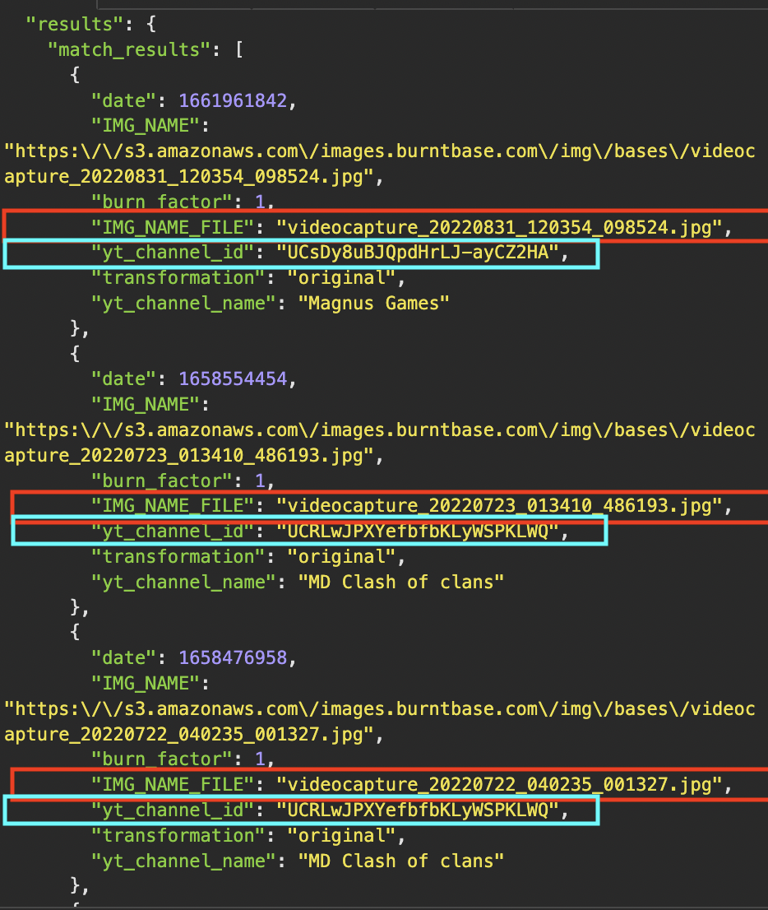

# Clash of Clans Burntbase Cooldown Bypass Guide

This is a Clash of Clans guide on how to view Burntbase videos without waiting for the 12 hour cooldown.

## Requirements

- An API client. I am using [Insomnia](https://insomnia.rest/download) for this guide.
- A browser with developer tools. I am using Google Chrome for this guide.

# Get your Access Token

- Go to https://www.burntbase.com/login
- Open developer tools and go to the Network tab
- Filter requests by XHR
- Login to Burntbase
- Click on the request named `me`
- Click on the `Headers` tab and scroll down until you find the `accesstoken` header
- Jot down the **access token**

# Upload Base Image to Scan

- Go to https://www.burntbase.com/search
- Upload the screenshot of the base you want to search
- Jot down the **scan number** after the https://www.burntbase.com/results/ URL

# Use an API Client to Get JSON Response

- Enter https://app.burntbase.com/api/auth/scans/###### (Replace ###### with your [scan number](#upload-base-image-to-scan)) in a GET Request
- In the header tab, enter `accesstoken` in header and your [accesstoken](#get-your-access-token) in value
- Send the request
- Scroll down the JSON response until you see the `"match_results"` key

# Finding the YouTube Videos with the Base
Now that we have all the information we need, it's time to look for the base on YouTube.\
The keys we are interested in are the `"IMG_NAME_FILE"` (in red) and the `"yt_channel_id"` (in cyan) keys.

All the values under the `"IMG_NAME_FILE"` key start with `"videocapture_YYYYMMDD_11111_222222.jpg"`.\
We are interested in the `YYYYMMDD` part of the value because this is when the YouTube video was published containing the scanned base.\
For example, in the above image, the first result's video was published on August 31, 2022 (20220831).\
The values under the `"yt_channel_id"` will be used to go to the YouTube channel that published the video by going to ``https://www.youtube.com/channel/(value for the "yt_channel_id" key)``.\
For example, in the above image, the first result's YouTube channel will be `https://www.youtube.com/channel/UCsDy8uBJQpdHrLJ-ayCZ2HA`.

## Searching Through the YouTube Channel
This is probably the most time consuming part of the process, depending on how old the video is, how long the video is, if the YouTube channel frequently uploads videos, or uploads many videos in one day.\
You just have to guess and click on a video until you get a video with the right published date.\
Then, you have to jump around the video until you find the base you are looking for.\
I prefer on hovering my mouse cursor over the video progress bar to see the bases quicker.\
Be aware that the base results can be rotated 90 degrees (`"rotate90"`), 180 degrees (`"rotate180"`), 270 degrees (`"rotate270"`), a vertical reflection (`"vertical_reflection"`), or a horizontal reflection (`"horizontal_reflection"`) from your original scanned screenshot (`"original"`) based on the `"transformation"` key in the JSON response.\
There are also some cases where the actual video with the scanned base is one day older than the date found in `"videocapture_YYYYMMDD_11111_222222.jpg"` (Ex. The date said 20220623 in the jpg, but the actual video's date with the scanned base was June 22, 2022 (20220622).

# Bingo! We found the base from the video that looks exactly like the blurred image that is still in a 12 hour cooldown on Burntbase in less than 5 minutes!
